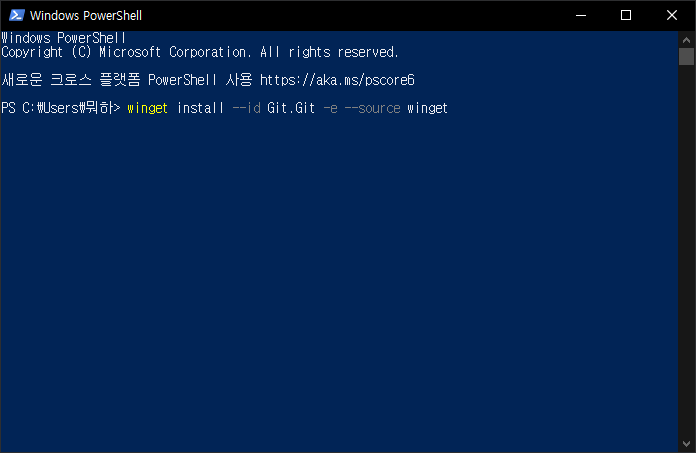
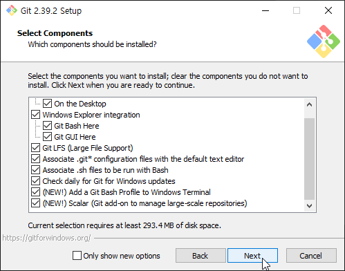
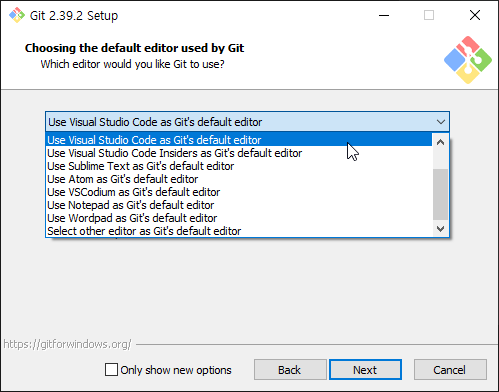
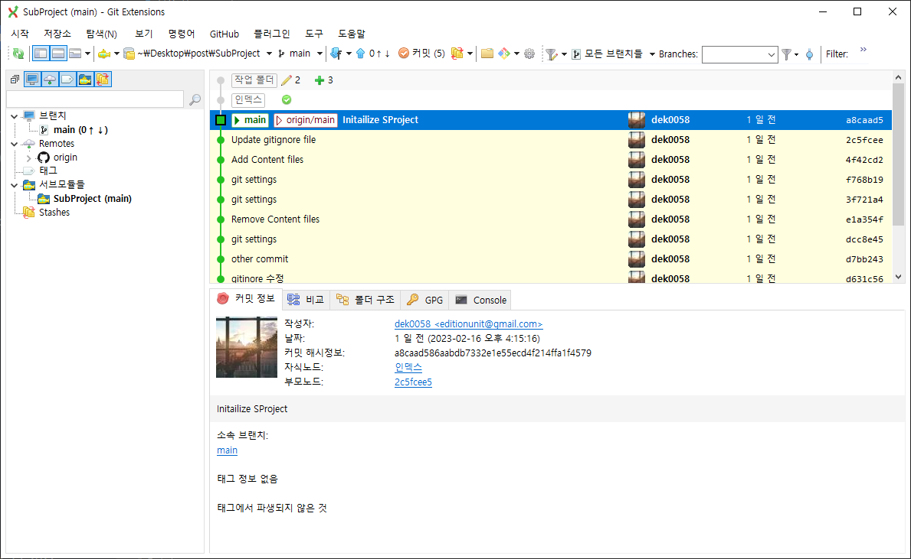
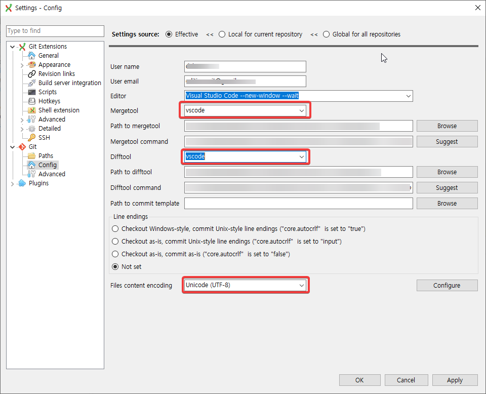
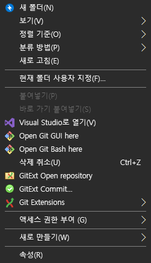
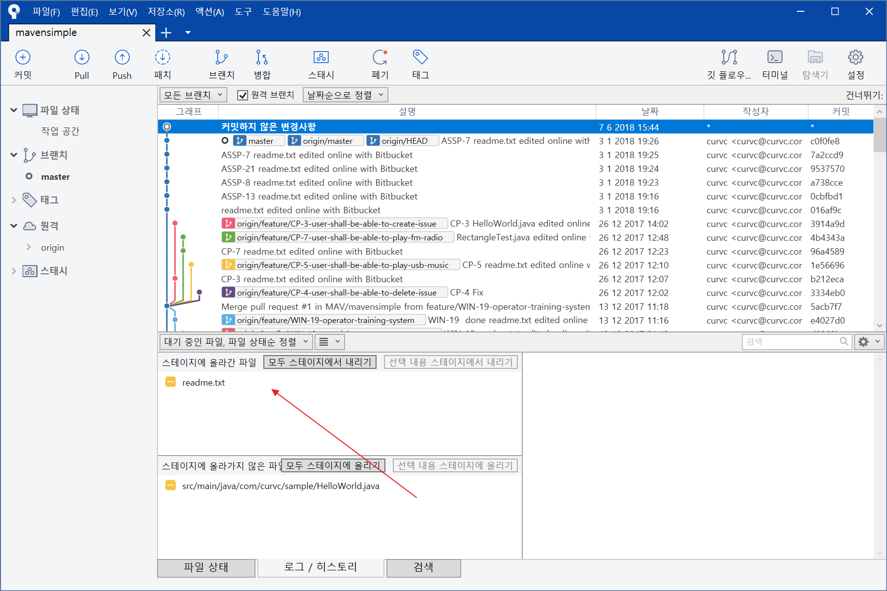
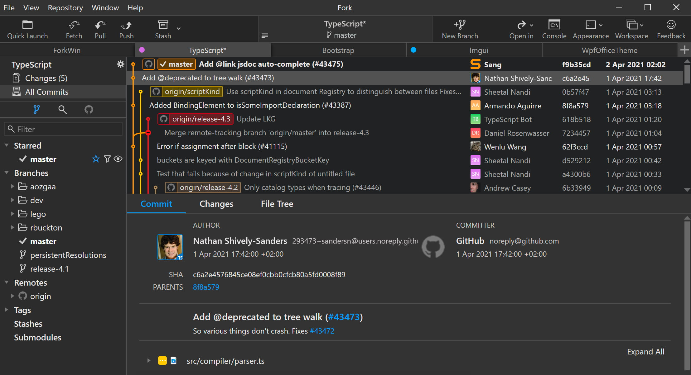

## [GIT 설치](https://git-scm.com/download/)

#### Window 간단 설치 방법

</img>
1. powershel 켜기

</img>
2. 아래 커맨드를 `powershell`에 입력 후 엔터
```shell
winget install --id Git.Git -e --source winget
```

****

#### 깃 설치 방법 (Window 사용자라면 위에 방법으로 간단하게 해주세요.)


1. `Next`



2. 사용 하시는 text edit tool을 선택하고 `Next`

****

#### GIT GUI 설치
깃을 커맨드 없이 쉽게 컨트롤 할 수 있도록 해주는 UI 툴 입니다.
여러 GUI가 있으며 주로 많이 사용 되는 툴은 `소스트리(SourceTree)`, `깃 익텐(Git Extension)`, `포크(Fork)`, `깃 데탑(Git Desktop)` 이 있습니다.
</br>

#### [깃 익텐(Git Extension)](https://github.com/gitextensions/gitextensions/releases/)



> C:에 다운 받아야 ContextMenu 레지스트 등록이 정상적으로 됩니다.

###### 첫 설정



> `User name`, `User email`, `MergeTool`, `DiffTool`를 지정하고 `Ok`를 누릅니다.****

<sub>**참고자료**</sub>


<sub>**[한글 적용 시키기](http://naver.me/GBlEFanC)**</sub>
> 경로를 바꾸지 않고 C:에 설치를 하였다면, `C:\Program Files (x86)\GitExtensions\Translation`경로에 알집을 풀어주시면 됩니다. <sub>*(※폴더 채로 푸는것이 아닌, 내용물을 넣어주세요.)*</sub>

</br>

#### [소스트리(SourceTree)](https://www.sourcetreeapp.com/)



> 한국어를 지원 합니다.

</br>

#### [포크(Fork)](https://git-fork.com/)



> UI가 에쁩니다.

</br>

#### [깃 데탑(Git Desktop)](https://desktop.github.com/?ref_cta=download+desktop&ref_loc=installing+github+desktop&ref_page=docs) <sub>[관련 문서](https://docs.github.com/ko/desktop/installing-and-authenticating-to-github-desktop/installing-github-desktop)</sub>


