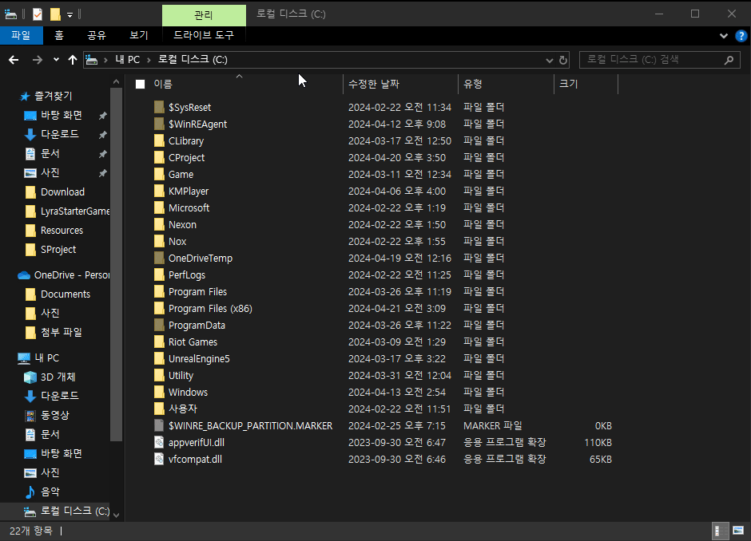
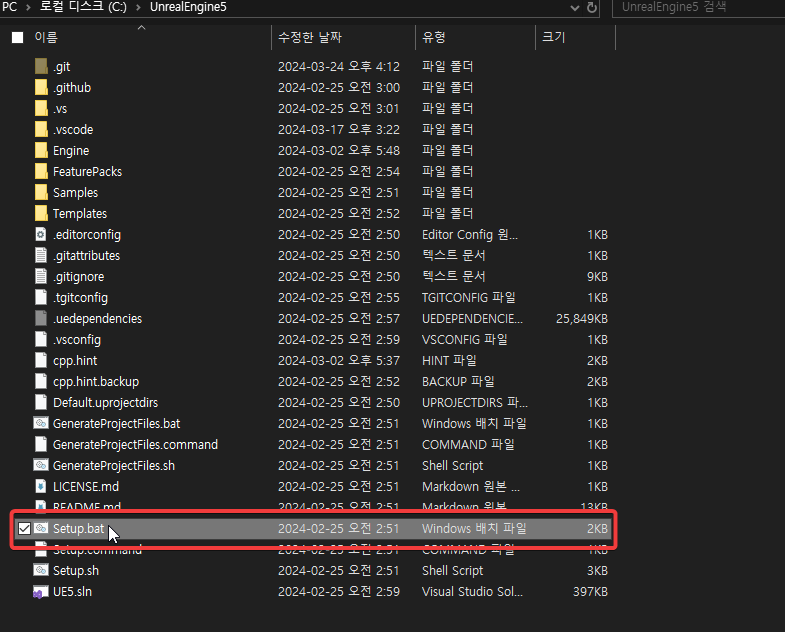
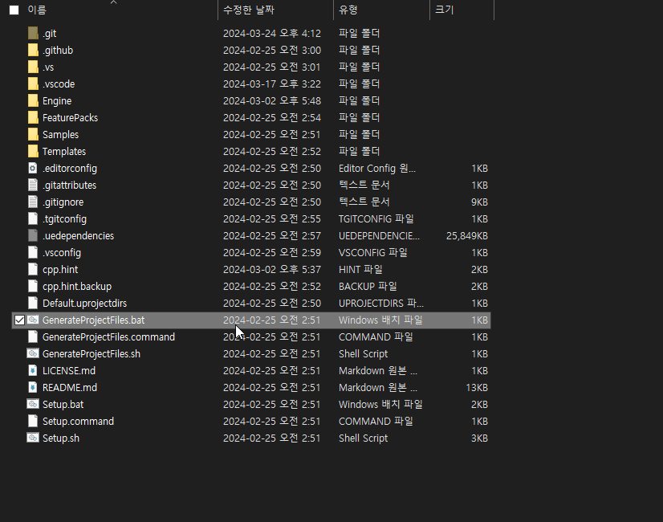
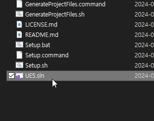
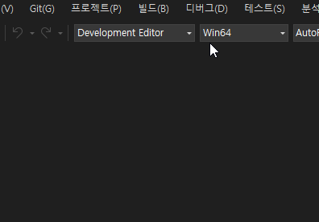
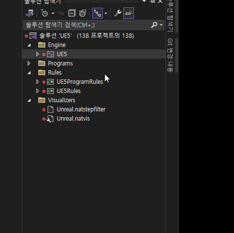


## Unreal Engine 설치 가이드

- 요구 사항
  * **[git 설치](https://git-scm.com/download/win)** <sub>[가이드](GUIDEGIT.md)</sub>
    - Github 계정
  * **[Visual Studio 설치](https://visualstudio.microsoft.com/ko/thank-you-downloading-visual-studio/?sku=Community&channel=Release&version=VS2022&source=VSLandingPage&cid=2030&passive=false)** <sub>[가이드](GUIDEVS.md)</sub>
    -  Microsoft 계정
  - <U>선택(권장)</U>
    * **[Visual Studio code 설치](https://code.visualstudio.com/docs/?dv=win64user)** <sub>[가이드](GUIDEVSCODE.md)</sub>&ensp;|&ensp;**[Notepad++ 설치](https://notepad-plus-plus.org/downloads/)**


****


1. 아래 명령어를 실행합니다.

```shell
git clone https://github.com/EpicRocket/SProject.git UnrealEngine
```


2. `Setup.bat`를 실행하여 언리얼 엔진을 설치합니다.
    - 설치 시, 도중에 관리자 권한 요청 및 .uproject 레지스트리 등록 팝업이 나타납니다. 모두 `확인`을 눌러주세요.


3. `GenerateProjectFiles.bat`를 실행시켜 `UE5.sln` 파일을 생성 시킵니다.


4. `UE5.sln`를 실행시켜 Visual Studio를 실행 시킵니다.


5. 솔구현 구성을 `Development Editor`로 변경 합니다.


6. 솔루션 탐색기에서 `UE5`를 마우스 우클릭하고, `Context Menu`에서 `빌드(L)`를 선택하여 빌드 합니다.
   - 이 작업은 오래걸릴 수 있습니다.(첫 빌드시 약 2~3시간)

7. **(선택)UnrealVS 설치<sub>(프로그래머가 아니라면 필요 없음)</sub>**
`언리얼 엔진\Engine\Extras\UnrealVS\VS2022`경로에서 UnrealVS.vsix 확장을 설치 할 수 있습니다.
    - [가이드](https://dev.epicgames.com/documentation/ko-kr/unreal-engine/using-the-unrealvs-extension-for-unreal-engine-cplusplus-projects?application_version=5.3)

****
### 알려진 문제 해결 방법

#### uproject 실행 안됨 | 없는 확장자 파일
`언리얼 엔진\Engine\Binaries\Win64`경로에서 `UnrealVersionSelector-Win64-Shipping.exe`실행