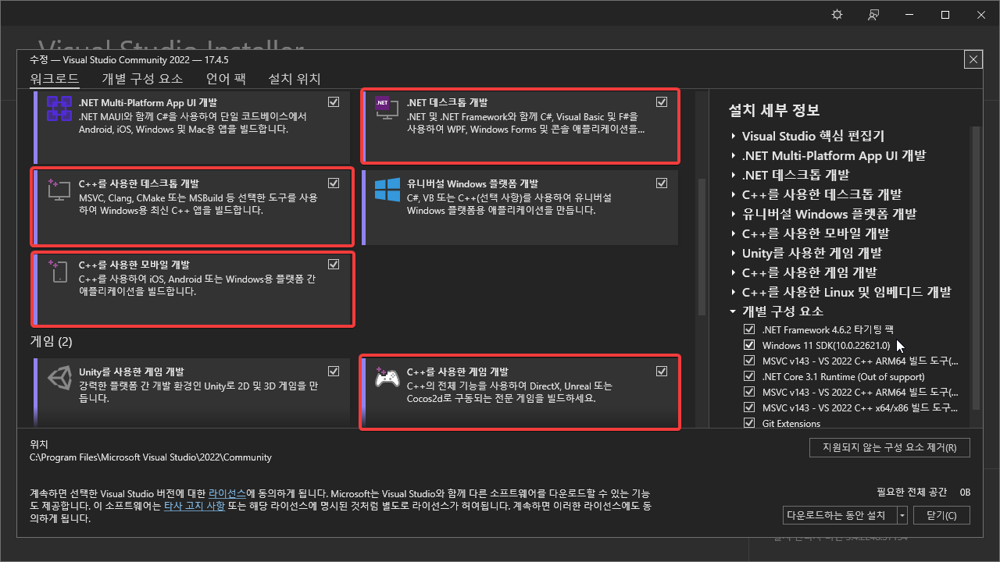
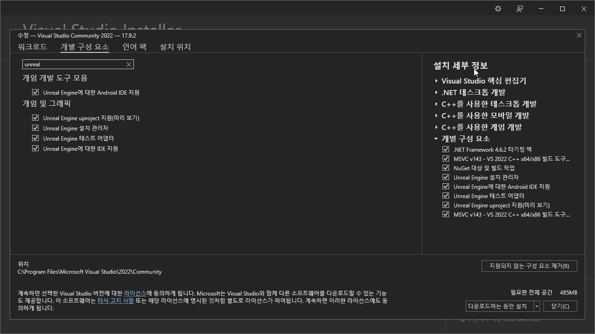

## [Visual Stuido](https://visualstudio.microsoft.com/ko/thank-you-downloading-visual-studio/?sku=Community&channel=Release&version=VS2022&source=VSLandingPage&cid=2030&passive=false)
#### Visual Studio 워크로드

  * .NET 데스크톱 개발
  * C++를 사용한 데스크톱 개발
  * C++를 사용한 모바일 개발(프로그래머만)
  * C++를 사용한 게임 개발

#### 프로그래머 추가 설정

Unreal Engine 관련 패키지를 설치하면 MS관련 편의 기능을 가질 수 있습니다.
